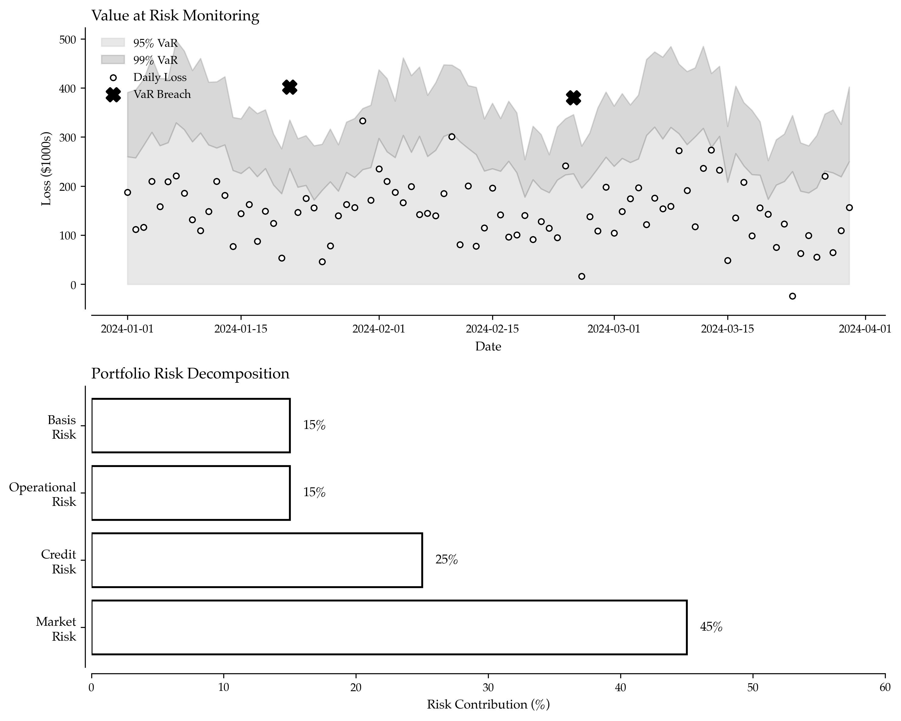

# Real-Time Risk Management for Power Portfolios: Preventing Catastrophic Losses

When Amaranth Advisors collapsed in September 2006, losing $6.6 billion in natural gas trading, the root cause wasn't bad luck—it was inadequate risk management. The fund's concentrated positions and insufficient stress testing left it vulnerable to a market move that, while extreme, was entirely possible. Traders with robust risk frameworks survived the same event; Amaranth did not.

In power trading, where prices can move 500% in hours and correlations break down during crises, risk management isn't a back-office function—it's the difference between survival and ruin. Professional risk management prevents catastrophic losses while enabling traders to size positions appropriately for maximum expected returns.

---

## Why Risk Management Defines Long-Term Success

Every power trader faces an inescapable reality: extreme events will occur. Transmission lines will fail. Heat waves will spike demand. Generators will experience unplanned outages. The question isn't whether these events happen, but whether your portfolio survives them.

Effective risk management serves multiple critical functions:
- **Prevents Catastrophic Losses**: Limits exposure to tail events that could eliminate years of gains
- **Enables Optimal Position Sizing**: Quantifies risk to determine appropriate position sizes
- **Identifies Hidden Correlations**: Reveals concentration risks that aren't obvious from notional exposures
- **Facilitates Rapid Response**: Provides real-time visibility into portfolio risk evolution
- **Supports Regulatory Compliance**: Documents risk controls for regulators and stakeholders



---

## Value at Risk (VaR): The Foundation Metric

VaR answers a simple question: "What is the maximum loss I can expect with X% confidence over Y time period?" This single number summarizes portfolio risk in intuitive terms.

The VaR calculation framework supports three methodologies, each with distinct strengths and weaknesses:

**Parametric VaR** assumes returns follow a normal distribution. It calculates portfolio returns from historical data, computes mean and standard deviation, then applies the normal distribution's percentile (z-score) to estimate maximum loss at specified confidence. Fast and mathematically elegant, but dangerous in power markets where price distributions have fat tails—extreme moves happen far more often than normal distributions predict.

**Historical VaR** uses actual historical returns to estimate risk. It simulates portfolio P&L using historical price movements, then selects the appropriate percentile (e.g., 5th percentile for 95% confidence). This captures actual market behavior including jumps, gaps, and fat tails. However, it assumes future will resemble past—unprecedented events (the "black swans") don't appear in historical data until after they happen.

**Monte Carlo VaR** generates thousands of simulated scenarios from the return distribution (mean, covariance matrix estimated from history). Each scenario produces a portfolio P&L outcome; the appropriate percentile becomes VaR. This method captures complexity and portfolio effects (correlations, nonlinearities), but accuracy depends critically on correct correlation assumptions—which often break down during crises.

Example calculations for a power portfolio (500 MW power position, -200 MMBtu gas position, +1,000 tons coal position) with 95% confidence and 1-day horizon might show:

- Parametric VaR: $15,000 (2.1% of portfolio)
- Historical VaR: $18,500 (2.6% of portfolio)  
- Monte Carlo VaR: $17,200 (2.4% of portfolio)

The variation across methods reveals inherent uncertainty in risk quantification. Professional traders calculate all three and use the maximum for conservative risk assessment—if parametric says $15k but Monte Carlo says $25k, plan for $25k.

(See Complete Implementation section for VaR calculation code)

---

## Stress Testing: Preparing for the Unexpected

VaR tells you normal losses under typical market conditions. Stress testing reveals catastrophic losses during extreme but plausible events—the scenarios that actually bankrupt portfolios.

Stress scenarios should include:

**Historical events**: "Heat Wave" (150% power spike, 80% gas spike, 25% coal spike), "Polar Vortex" (200% power spike, 300% gas spike), "Gas Supply Disruption" (250% gas spike forcing coal substitution).

**Hypothetical shocks**: "Transmission Failure" (180% power spike), "Renewable Lull" (low wind/solar forces thermal backup), "Market Volatility Spike" (extreme moves across all commodities).

**Tail events**: "2021 Texas Storm Replay" (1,000% power spike, 600% gas spike)—the scenario everyone says "can't happen again" but absolutely can.

For each scenario, the system applies price shocks to every position, calculates P&L impacts, and classifies severity: CRITICAL (>15% of portfolio), HIGH (>10%), MODERATE (<10%). The Texas Storm scenario might produce a $450,000 loss (63% of portfolio)—clearly catastrophic. Even if VaR says daily risk is $15k, this stress test reveals the portfolio could lose everything in a single extreme event.

**The critical insight**: If a plausible scenario bankrupts your portfolio, reduce exposure regardless of what VaR says. Position limits should be set by stress tests, not just VaR. Professional traders maintain "stress VaR"—the maximum loss across all stress scenarios—below capital thresholds that would trigger liquidation.

(See Complete Implementation section for stress testing code)

---

## Concentration Risk and Correlation Analysis

Diversification only works if positions aren't secretly correlated. During the 2008 financial crisis, traders holding "diversified" portfolios discovered all their assets moved together—diversification disappeared exactly when needed most.

**Concentration analysis** quantifies exposure concentration using the Herfindahl index: sum of squared exposure shares. Score of 1.0 means 100% in one asset (maximum concentration). Score of 0.33 means equal weight in three assets. Scores above 0.3 indicate dangerous concentration—a single position dominates portfolio risk.

**Effective positions** accounting for correlations reveals true diversification. A portfolio might hold 10 positions, but if they're all highly correlated, effective positions might be only 3—meaning diversification benefit is minimal. Calculate via: 1 / (weights^T × correlation_matrix × weights). During normal markets, 10 positions might provide 7 effective positions (decent diversification). During crises, when correlations spike toward 1.0, effective positions drop to 2-3—diversification collapses.

**Net-to-gross ratio** reveals hedge effectiveness. Gross exposure of $1M with net exposure of $50k (5% net/gross) suggests well-hedged portfolio. Net/gross of 80% suggests directional bet with minimal hedging—high risk.

Example analysis for a power/gas/coal portfolio shows:
- Gross exposure: $117,500
- Net exposure: $85,500
- Net/gross: 73% (moderately high—portfolio has significant directional bias)
- Concentration score: 0.42 (concerning—single asset exceeds safe threshold)
- Effective positions: 2.3 out of 3 (limited diversification benefit)
- Largest exposure: Power spot at 44% of portfolio (dangerous concentration)

**Action**: Diversify power exposure across multiple hubs, add options for convexity, consider spread trades to reduce net directional exposure.

(See Complete Implementation section for concentration analysis code)

---

## Real-Time Risk Monitoring Dashboard

Professional risk management requires continuous monitoring, not daily batch reports. Markets move intraday; risk evolves continuously; responses must be immediate.

The risk dashboard calculates multiple metrics every 15-30 minutes:

**VaR at multiple confidence levels**: 95% VaR ($15k) and 99% VaR ($35k) bracket normal vs extreme daily losses. Track utilization against limits: if 99% VaR limit is $50k and current is $48k, portfolio is 96% utilized—dangerously close to requiring forced deleveraging.

**Concentration metrics**: Gross exposure, net exposure, concentration score, effective positions. Rising concentration score signals increasing risk from position growth in single assets.

**Limit utilization**: Each risk metric displays as percentage of limit. VaR at 60% of limit = room to add positions. VaR at 95% of limit = stop adding risk, consider reducing. VaR at 105% of limit = CRITICAL alert, immediate deleveraging required.

**Automated alerts** trigger when metrics breach thresholds:
- HIGH severity: VaR 95% exceeds limit → Reduce positions or add hedges
- CRITICAL severity: VaR 99% exceeds limit → Immediately reduce exposures, no new trades
- MEDIUM severity: Single asset >40% of portfolio → Diversify into additional assets

**Risk status**: NORMAL (all metrics within limits), MEDIUM (minor breaches), HIGH (significant breaches), CRITICAL (must act immediately). Trading desks use traffic light displays: green = NORMAL, yellow = MEDIUM, orange = HIGH, red = CRITICAL.

Real-time monitoring enables immediate response. If a sudden market move pushes VaR from $15k to $55k (exceeding $50k limit), alerts fire within minutes. Traders can sell down positions before small losses cascade into catastrophic ones. Contrast this with daily batch reporting where breaches might not be discovered until the next morning—potentially after significant losses have occurred.

(See Complete Implementation section for dashboard code)

---

## Key Takeaways for Risk Management

Professional risk management transforms trading from gambling into calculated risk-taking:

**VaR Is a Starting Point, Not the End**: Calculate VaR using multiple methods (parametric, historical, Monte Carlo), but don't stop there. Stress testing reveals what VaR misses—the tail events that actually cause catastrophic losses.

**Stress Test Against History and Imagination**: If your portfolio can't survive a "Texas Storm Replay," reduce exposure now. Historical worst-cases will happen again. The scenario everyone says "that was a once-in-a-century event" often repeats within a decade.

**Correlations Increase in Crises**: Diversification that works in normal markets disappears during crises when you need it most. Size positions assuming correlations will spike to 0.8-0.9 during stress, not the 0.3-0.5 you observe in calm periods.

**Real-Time Monitoring Is Essential**: Risk evolves continuously as markets move. Daily risk reports are obsolete—monitor intraday and respond immediately to breaches. By the time tomorrow's batch report runs, losses may be irreversible.

**Limits Must Be Enforced**: Risk limits without enforcement are suggestions. Automated systems that prevent limit breaches protect against human judgment errors during volatile markets when adrenaline and fear cloud rational decision-making.


---

## Complete Implementation

All code for risk management is consolidated below, including VaR calculation, stress testing, concentration analysis, and real-time monitoring dashboards.

### Value at Risk Calculation

```python
import numpy as np
from scipy.stats import norm
import pandas as pd

def calculate_portfolio_var(positions, price_data, confidence_level=0.95, 
                           time_horizon_days=1, method='parametric'):
    """
    Calculate Value at Risk for power trading portfolio.
    
    Supports multiple VaR methodologies:
    - Parametric (assumes normal distribution)
    - Historical simulation (uses actual historical returns)
    - Monte Carlo (generates scenarios from return distribution)
    """
    n_positions = len(positions)
    
    # Method calculators dictionary
    def calculate_parametric():
        returns = [np.diff(price_data[p['asset']]) / price_data[p['asset']][:-1] for p in positions]
        returns_matrix = np.array(returns).T
        position_weights = np.array([p['quantity'] * p['current_price'] for p in positions])
        total_value = np.sum(position_weights)
        weights = position_weights / total_value
        portfolio_returns = returns_matrix @ weights
        portfolio_mean = np.mean(portfolio_returns)
        portfolio_std = np.std(portfolio_returns)
        scaled_std = portfolio_std * np.sqrt(time_horizon_days)
        z_score = norm.ppf(1 - confidence_level)
        var_pct = portfolio_mean * time_horizon_days + z_score * scaled_std
        var_dollars = abs(var_pct) * total_value
        
        return {
            'method': 'parametric',
            'var_pct': var_pct * 100,
            'var_dollars': var_dollars,
            'confidence_level': confidence_level,
            'time_horizon_days': time_horizon_days,
            'portfolio_value': total_value,
            'expected_return': portfolio_mean * time_horizon_days * 100,
            'volatility': portfolio_std * np.sqrt(252) * 100
        }
    
    def calculate_historical():
        position_weights = np.array([p['quantity'] * p['current_price'] for p in positions])
        total_value = np.sum(position_weights)
        returns = [np.diff(price_data[p['asset']]) / price_data[p['asset']][:-1] * 
                  p['quantity'] * p['current_price'] for p in positions]
        portfolio_pnl = np.sum(returns, axis=0)
        var_dollars = abs(np.percentile(portfolio_pnl, (1 - confidence_level) * 100))
        var_pct = var_dollars / total_value * 100
        
        return {
            'method': 'historical',
            'var_pct': var_pct,
            'var_dollars': var_dollars,
            'confidence_level': confidence_level,
            'time_horizon_days': time_horizon_days,
            'portfolio_value': total_value,
            'worst_historical_loss': abs(np.min(portfolio_pnl)),
            'best_historical_gain': np.max(portfolio_pnl)
        }
    
    def calculate_monte_carlo():
        position_weights = np.array([p['quantity'] * p['current_price'] for p in positions])
        total_value = np.sum(position_weights)
        returns = [np.diff(price_data[p['asset']]) / price_data[p['asset']][:-1] for p in positions]
        returns_matrix = np.array(returns).T
        mean_returns = np.mean(returns_matrix, axis=0)
        cov_matrix = np.cov(returns_matrix.T)
        n_scenarios = 10000
        scenarios = np.random.multivariate_normal(
            mean_returns * time_horizon_days,
            cov_matrix * time_horizon_days,
            n_scenarios
        )
        weights = position_weights / total_value
        portfolio_returns = scenarios @ weights
        portfolio_pnl = portfolio_returns * total_value
        var_dollars = abs(np.percentile(portfolio_pnl, (1 - confidence_level) * 100))
        var_pct = var_dollars / total_value * 100
        
        return {
            'method': 'monte_carlo',
            'var_pct': var_pct,
            'var_dollars': var_dollars,
            'confidence_level': confidence_level,
            'time_horizon_days': time_horizon_days,
            'portfolio_value': total_value,
            'n_scenarios': n_scenarios,
            'expected_return': np.mean(portfolio_pnl),
            'worst_scenario': np.min(portfolio_pnl),
            'best_scenario': np.max(portfolio_pnl)
        }
    
    # Method dispatcher
    method_calculators = {
        'parametric': calculate_parametric,
        'historical': calculate_historical,
        'monte_carlo': calculate_monte_carlo
    }
    
    return method_calculators.get(method, calculate_parametric)()

# Example: Calculate VaR for power portfolio
positions = [
    {'asset': 'power_spot', 'quantity': 500, 'current_price': 85.00},      # 500 MW power
    {'asset': 'gas_futures', 'quantity': -200, 'current_price': 4.50},     # Short 200 MMBtu gas
    {'asset': 'coal_forward', 'quantity': 1000, 'current_price': 75.00}    # Long coal
]

# Generate sample price data
np.random.seed(42)
price_data = {
    'power_spot': 85 + np.cumsum(np.random.randn(252) * 5),
    'gas_futures': 4.5 + np.cumsum(np.random.randn(252) * 0.3),
    'coal_forward': 75 + np.cumsum(np.random.randn(252) * 3)
}

# Calculate VaR using all three methods
var_parametric = calculate_portfolio_var(positions, price_data, confidence_level=0.95, method='parametric')
var_historical = calculate_portfolio_var(positions, price_data, confidence_level=0.95, method='historical')
var_monte_carlo = calculate_portfolio_var(positions, price_data, confidence_level=0.95, method='monte_carlo')

print("Value at Risk Analysis (95% Confidence, 1-Day Horizon):")
print(f"\nParametric VaR:")
print(f"  VaR: ${var_parametric['var_dollars']:,.2f} ({var_parametric['var_pct']:.2f}%)")
print(f"  Portfolio Value: ${var_parametric['portfolio_value']:,.2f}")
print(f"  Annualized Volatility: {var_parametric['volatility']:.1f}%")

print(f"\nHistorical VaR:")
print(f"  VaR: ${var_historical['var_dollars']:,.2f} ({var_historical['var_pct']:.2f}%)")
print(f"  Worst Historical Loss: ${var_historical['worst_historical_loss']:,.2f}")

print(f"\nMonte Carlo VaR:")
print(f"  VaR: ${var_monte_carlo['var_dollars']:,.2f} ({var_monte_carlo['var_pct']:.2f}%)")
print(f"  Worst Scenario: ${var_monte_carlo['worst_scenario']:,.2f}")
print(f"  Best Scenario: ${var_monte_carlo['best_scenario']:,.2f}")
```

---

### Stress Testing

```python
def stress_test_portfolio(positions, stress_scenarios):
    """
    Apply extreme but plausible scenarios to portfolio.
    
    Stress scenarios include historical events, hypothetical shocks,
    and worst-case combinations of risk factors.
    """
    portfolio_value = sum(p['quantity'] * p['current_price'] for p in positions)
    stress_results = []
    
    for scenario in stress_scenarios:
        scenario_pnl = 0
        position_impacts = []
        
        for position in positions:
            asset = position['asset']
            quantity = position['quantity']
            current_price = position['current_price']
            position_value = quantity * current_price
            
            # Apply scenario shock to asset using dictionary lookup
            price_shock_pct = scenario['shocks'].get(asset, 0)
            new_price = current_price * (1 + price_shock_pct / 100)
            position_pnl = quantity * (new_price - current_price)
            
            scenario_pnl += position_pnl
            position_impacts.append({
                'asset': asset,
                'position_value': position_value,
                'pnl': position_pnl,
                'pnl_pct': (position_pnl / (abs(position_value) + (position_value == 0))) * 100 * (position_value != 0)
            })
        
        # Severity calculation using dictionary lookup
        pnl_ratio = abs(scenario_pnl) / portfolio_value
        severity_thresholds = [(0.15, 'CRITICAL'), (0.10, 'HIGH'), (0, 'MODERATE')]
        severity = next((sev for thresh, sev in filter(lambda x: pnl_ratio > x[0], severity_thresholds)), 'MODERATE')
        
        stress_results.append({
            'scenario_name': scenario['name'],
            'scenario_description': scenario['description'],
            'total_pnl': scenario_pnl,
            'pnl_pct': (scenario_pnl / portfolio_value) * 100,
            'position_impacts': position_impacts,
            'severity': severity
        })
    
    # Rank by severity
    stress_results.sort(key=lambda x: abs(x['total_pnl']), reverse=True)
    
    return {
        'portfolio_value': portfolio_value,
        'stress_results': stress_results,
        'worst_scenario': next(iter(stress_results), None),
        'scenarios_critical': sum(s['severity'] == 'CRITICAL' for s in stress_results),
        'scenarios_high': sum(s['severity'] == 'HIGH' for s in stress_results)
    }

# Define stress scenarios
stress_scenarios = [
    {
        'name': 'Heat Wave',
        'description': 'Extended heat wave drives power demand surge',
        'shocks': {
            'power_spot': +150,      # Power up 150%
            'gas_futures': +80,      # Gas up 80%
            'coal_forward': +25      # Coal up 25%
        }
    },
    {
        'name': 'Polar Vortex',
        'description': 'Extreme cold weather event',
        'shocks': {
            'power_spot': +200,
            'gas_futures': +300,     # Gas spikes dramatically
            'coal_forward': +40
        }
    },
    {
        'name': 'Gas Supply Disruption',
        'description': 'Major pipeline outage cuts gas supply',
        'shocks': {
            'power_spot': +120,
            'gas_futures': +250,
            'coal_forward': +50      # Coal substitute demand
        }
    },
    {
        'name': 'Transmission Failure',
        'description': 'Major transmission line outage',
        'shocks': {
            'power_spot': +180,
            'gas_futures': +30,
            'coal_forward': +10
        }
    },
    {
        'name': 'Renewable Lull',
        'description': 'Low wind/solar generation forces thermal backup',
        'shocks': {
            'power_spot': +60,
            'gas_futures': +40,
            'coal_forward': +30
        }
    },
    {
        'name': 'Market Volatility Spike',
        'description': 'Extreme volatility across all commodities',
        'shocks': {
            'power_spot': +250,
            'gas_futures': +180,
            'coal_forward': +60
        }
    },
    {
        'name': '2021 Texas Storm Replay',
        'description': 'Repeat of February 2021 Texas event',
        'shocks': {
            'power_spot': +1000,     # 10x normal prices
            'gas_futures': +600,
            'coal_forward': +80
        }
    }
]

# Run stress tests
stress_analysis = stress_test_portfolio(positions, stress_scenarios)

print("\nStress Testing Results:")
print(f"Portfolio Value: ${stress_analysis['portfolio_value']:,.2f}")
print(f"Critical Scenarios: {stress_analysis['scenarios_critical']}")
print(f"High-Risk Scenarios: {stress_analysis['scenarios_high']}")

print(f"\nWorst Scenario: {stress_analysis['worst_scenario']['scenario_name']}")
print(f"  Description: {stress_analysis['worst_scenario']['scenario_description']}")
print(f"  P&L Impact: ${stress_analysis['worst_scenario']['total_pnl']:,.2f}")
print(f"  % of Portfolio: {stress_analysis['worst_scenario']['pnl_pct']:.1f}%")
print(f"  Severity: {stress_analysis['worst_scenario']['severity']}")

print("\nTop 3 Risk Scenarios:")
for i, scenario in enumerate(stress_analysis['stress_results'][:3], 1):
    print(f"\n{i}. {scenario['scenario_name']} [{scenario['severity']}]")
    print(f"   Impact: ${scenario['total_pnl']:,.2f} ({scenario['pnl_pct']:+.1f}%)")
```

---

### Concentration Risk Analysis

```python
def analyze_concentration_risk(positions, correlation_matrix):
    """
    Identify concentration risks in portfolio.
    
    Calculates concentration by asset class, geography, and risk factor.
    Reveals hidden correlations that amplify risk during crises.
    """
    total_gross_exposure = sum(abs(p['quantity'] * p['current_price']) for p in positions)
    total_net_exposure = sum(p['quantity'] * p['current_price'] for p in positions)
    
    # Calculate concentration by asset
    asset_exposure = {}
    for position in positions:
        asset = position['asset']
        exposure = abs(position['quantity'] * position['current_price'])
        asset_exposure[asset] = asset_exposure.get(asset, 0) + exposure
    
    # Calculate concentration score (Herfindahl index)
    concentration_score = sum((exp / total_gross_exposure) ** 2 for exp in asset_exposure.values())
    
    # Analyze effective diversification accounting for correlations
    # Effective positions = 1 / sum(weight_i * weight_j * correlation_ij)
    weights = np.array([abs(p['quantity'] * p['current_price']) / total_gross_exposure 
                       for p in positions])
    
    # Calculate portfolio variance considering correlations
    if correlation_matrix is not None:
        portfolio_variance = weights @ correlation_matrix @ weights
        effective_positions = 1 / portfolio_variance if portfolio_variance > 0 else len(positions)
    else:
        portfolio_variance = 0
        effective_positions = len(positions)
    
    # Identify top concentrations
    sorted_exposures = sorted(asset_exposure.items(), key=lambda x: x[1], reverse=True)
    
    return {
        'total_gross_exposure': total_gross_exposure,
        'total_net_exposure': total_net_exposure,
        'net_to_gross_ratio': (total_net_exposure / (total_gross_exposure + (total_gross_exposure == 0))) * (total_gross_exposure > 0),
        'concentration_score': concentration_score,
        'effective_positions': effective_positions,
        'diversification_ratio': effective_positions / len(positions),
        'asset_exposures': sorted_exposures,
        'largest_exposure_pct': (sorted_exposures[0][1] / total_gross_exposure * 100) * bool(sorted_exposures)
    }

# Example correlation matrix (power, gas, coal)
correlation_matrix = np.array([
    [1.00, 0.75, 0.45],  # Power correlations
    [0.75, 1.00, 0.30],  # Gas correlations
    [0.45, 0.30, 1.00]   # Coal correlations
])

concentration = analyze_concentration_risk(positions, correlation_matrix)

print("\nConcentration Risk Analysis:")
print(f"  Total Gross Exposure: ${concentration['total_gross_exposure']:,.2f}")
print(f"  Total Net Exposure: ${concentration['total_net_exposure']:,.2f}")
print(f"  Net/Gross Ratio: {concentration['net_to_gross_ratio']:.2%}")
print(f"  Concentration Score: {concentration['concentration_score']:.3f}")
print(f"  Effective Positions: {concentration['effective_positions']:.1f}")
print(f"  Diversification Ratio: {concentration['diversification_ratio']:.1%}")
print(f"\nExposure by Asset:")
for asset, exposure in concentration['asset_exposures']:
    pct = exposure / concentration['total_gross_exposure'] * 100
    print(f"  {asset}: ${exposure:,.2f} ({pct:.1f}%)")
```

---

### Real-Time Risk Dashboard

```python
def generate_risk_dashboard(positions, market_data, risk_limits):
    """
    Generate comprehensive real-time risk dashboard.
    
    Monitors multiple risk metrics against established limits,
    generating alerts when thresholds are breached.
    """
    # Calculate all risk metrics
    var_95 = calculate_portfolio_var(positions, market_data, confidence_level=0.95, method='monte_carlo')
    var_99 = calculate_portfolio_var(positions, market_data, confidence_level=0.99, method='monte_carlo')
    
    concentration = analyze_concentration_risk(positions, None)
    
    # Check against limits using list comprehension
    alert_checks = [
        {
            'condition': var_95['var_dollars'] > risk_limits['max_var_95'],
            'alert': {
                'severity': 'HIGH',
                'metric': 'VaR 95%',
                'current': var_95['var_dollars'],
                'limit': risk_limits['max_var_95'],
                'breach_pct': (var_95['var_dollars'] / risk_limits['max_var_95'] - 1) * 100,
                'action': 'Reduce position sizes or add hedges'
            }
        },
        {
            'condition': var_99['var_dollars'] > risk_limits['max_var_99'],
            'alert': {
                'severity': 'CRITICAL',
                'metric': 'VaR 99%',
                'current': var_99['var_dollars'],
                'limit': risk_limits['max_var_99'],
                'breach_pct': (var_99['var_dollars'] / risk_limits['max_var_99'] - 1) * 100,
                'action': 'Immediately reduce exposures'
            }
        },
        {
            'condition': concentration['largest_exposure_pct'] > risk_limits['max_single_exposure_pct'],
            'alert': {
                'severity': 'MEDIUM',
                'metric': 'Single Asset Concentration',
                'current': concentration['largest_exposure_pct'],
                'limit': risk_limits['max_single_exposure_pct'],
                'breach_pct': (concentration['largest_exposure_pct'] / risk_limits['max_single_exposure_pct'] - 1) * 100,
                'action': 'Diversify into additional assets'
            }
        }
    ]
    
    alerts = list(map(lambda x: x['alert'], filter(lambda x: x['condition'], alert_checks)))
    
    # Calculate utilization percentages
    var_95_utilization = (var_95['var_dollars'] / risk_limits['max_var_95']) * 100
    var_99_utilization = (var_99['var_dollars'] / risk_limits['max_var_99']) * 100
    
    return {
        'timestamp': pd.Timestamp.now(),
        'portfolio_value': var_95['portfolio_value'],
        'risk_metrics': {
            'var_95': var_95['var_dollars'],
            'var_99': var_99['var_dollars'],
            'var_95_pct': var_95['var_pct'],
            'var_99_pct': var_99['var_pct'],
            'expected_return': var_95.get('expected_return', 0),
            'volatility': var_95.get('volatility', 0)
        },
        'concentration_metrics': {
            'gross_exposure': concentration['total_gross_exposure'],
            'net_exposure': concentration['total_net_exposure'],
            'concentration_score': concentration['concentration_score'],
            'effective_positions': concentration['effective_positions']
        },
        'limit_utilization': {
            'var_95': var_95_utilization,
            'var_99': var_99_utilization
        },
        'alerts': alerts,
        'risk_status': next(
            filter(lambda severity: any(map(lambda a: a['severity'] == severity, alerts)),
                   ['CRITICAL', 'HIGH', 'MEDIUM']),
            'NORMAL'
        )
    }

# Define risk limits
risk_limits = {
    'max_var_95': 500000,          # $500K max VaR at 95%
    'max_var_99': 1000000,         # $1M max VaR at 99%
    'max_single_exposure_pct': 40,  # No more than 40% in single asset
    'max_concentration_score': 0.35
}

# Generate dashboard
dashboard = generate_risk_dashboard(positions, price_data, risk_limits)

print("\nReal-Time Risk Dashboard")
print("=" * 60)
print(f"Status: {dashboard['risk_status']}")
print(f"Portfolio Value: ${dashboard['portfolio_value']:,.2f}")

print(f"\nRisk Metrics:")
print(f"  VaR 95%: ${dashboard['risk_metrics']['var_95']:,.2f} ({dashboard['limit_utilization']['var_95']:.0f}% of limit)")
print(f"  VaR 99%: ${dashboard['risk_metrics']['var_99']:,.2f} ({dashboard['limit_utilization']['var_99']:.0f}% of limit)")

print(f"\nConcentration:")
print(f"  Gross Exposure: ${dashboard['concentration_metrics']['gross_exposure']:,.2f}")
print(f"  Net Exposure: ${dashboard['concentration_metrics']['net_exposure']:,.2f}")
print(f"  Effective Positions: {dashboard['concentration_metrics']['effective_positions']:.1f}")

# Display alerts or confirmation message
alert_messages = [f"\n⚠️  ACTIVE ALERTS ({len(dashboard['alerts'])}):" + 
                  ''.join(f"\n  [{a['severity']}] {a['metric']}\n    Current: {a['current']:,.2f} | Limit: {a['limit']:,.2f} | Breach: +{a['breach_pct']:.0f}%\n    Action: {a['action']}" 
                          for a in dashboard['alerts'])] * bool(dashboard['alerts']) + \
                 ["\n✅ All metrics within limits"] * (not bool(dashboard['alerts']))

print(alert_messages[0])
```
